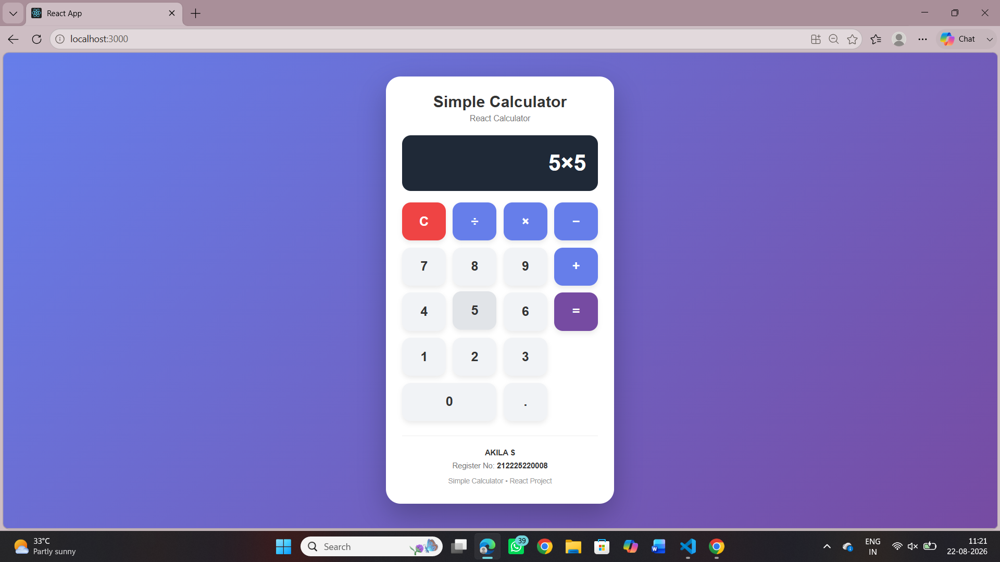

# Ex04 Simple Calculator - React Project
## Date:22-08-2026
## Name : AKILA S
## Reg No :212225220008

## AIM
To  develop a Simple Calculator using React.js with clean and responsive design, ensuring a smooth user experience across different screen sizes.

## ALGORITHM
### STEP 1
Create a React App.

### STEP 2
Open a terminal and run:
  <ul><li>npx create-react-app simple-calculator</li>
  <li>cd simple-calculator</li>
  <li>npm start</li></ul>

### STEP 3
Inside the src/ folder, create a new file Calculator.js and define the basic structure.

### STEP 4
Plan the UI: Display screen, number buttons (0-9), operators (+, -, *, /), clear (C), and equal (=).

### STEP 5
Create a new file Calculator.css in src/ and add the styling.

### STEP 6
Open src/App.js and modify it.

### STEP 7
Start the development server.
  npm start

### STEP 8
Open http://localhost:3000/ in the browser.

### STEP 9
Test the calculator by entering numbers and operations.

### STEP 10
Fix styling issues and refine content placement.

### STEP 11
Deploy the website.

### STEP 12
Upload to GitHub Pages for free hosting.

## PROGRAM
```
App.js
import React, { useState } from "react";
import "./App.css";

function App() {
  const [display, setDisplay] = useState("0");

  const handleNumber = (number) => {
    if (display === "Error") {
      setDisplay(number);
    } else {
      setDisplay(display === "0" ? number : display + number);
    }
  };

  const handleOperator = (operator) => {
    if (display === "Error") {
      return;
    }

    setDisplay((prev) => prev + operator);
  };

  const handleClear = () => {
    setDisplay("0");
  };

  const handleDecimal = () => {
    if (display === "Error") {
      setDisplay("0.");
      return;
    }

    setDisplay((prev) => prev + ".");
  };

  const handleEqual = () => {
    try {
      const expression = display
        .replace(/×/g, "*")
        .replace(/÷/g, "/")
        .replace(/−/g, "-");

      const result = Function(
        `"use strict"; return (${expression})`
      )();

      setDisplay(String(result));
    } catch (error) {
      setDisplay("Error");
    }
  };

  return (
    <div className="calculator-page">

      <div className="calculator">

        <div className="calculator-header">
          <h1>Simple Calculator</h1>
          <p>React Calculator</p>
        </div>

        <div className="display">
          {display}
        </div>

        <div className="buttons">

          {/* First Row */}
          <button
            className="clear"
            onClick={handleClear}
          >
            C
          </button>

          <button
            className="operator"
            onClick={() => handleOperator("÷")}
          >
            ÷
          </button>

          <button
            className="operator"
            onClick={() => handleOperator("×")}
          >
            ×
          </button>

          <button
            className="operator"
            onClick={() => handleOperator("−")}
          >
            −
          </button>

          {/* Second Row */}
          <button onClick={() => handleNumber("7")}>
            7
          </button>

          <button onClick={() => handleNumber("8")}>
            8
          </button>

          <button onClick={() => handleNumber("9")}>
            9
          </button>

          <button
            className="operator"
            onClick={() => handleOperator("+")}
          >
            +
          </button>

          {/* Third Row */}
          <button onClick={() => handleNumber("4")}>
            4
          </button>

          <button onClick={() => handleNumber("5")}>
            5
          </button>

          <button onClick={() => handleNumber("6")}>
            6
          </button>

          <button
            className="equal"
            onClick={handleEqual}
          >
            =
          </button>

          {/* Fourth Row */}
          <button onClick={() => handleNumber("1")}>
            1
          </button>

          <button onClick={() => handleNumber("2")}>
            2
          </button>

          <button onClick={() => handleNumber("3")}>
            3
          </button>

          {/* Fifth Row */}
          <button
            className="zero"
            onClick={() => handleNumber("0")}
          >
            0
          </button>

          <button onClick={handleDecimal}>
            .
          </button>

        </div>

        <footer className="footer">
          <p>
            <strong>YOUR AKILA S</strong>
          </p>

          <p>
            Register No:
            <strong> 212225220008</strong>
          </p>

          <p className="project-name">
            Simple Calculator • React Project
          </p>
        </footer>

      </div>

    </div>
  );
}

export default App;

app.css
* {
  margin: 0;
  padding: 0;
  box-sizing: border-box;
}

body {
  font-family: Arial, Helvetica, sans-serif;
}

/* Main page */

.calculator-page {
  min-height: 100vh;

  display: flex;
  justify-content: center;
  align-items: center;

  padding: 20px;

  background: linear-gradient(
    135deg,
    #667eea,
    #764ba2
  );
}

/* Calculator box */

.calculator {
  width: 390px;
  max-width: 100%;

  padding: 28px;

  background: #ffffff;

  border-radius: 25px;

  box-shadow:
    0 20px 50px rgba(0, 0, 0, 0.25);
}

/* Header */

.calculator-header {
  text-align: center;

  margin-bottom: 20px;
}

.calculator-header h1 {
  font-size: 27px;

  color: #333333;

  margin-bottom: 6px;
}

.calculator-header p {
  font-size: 14px;

  color: #777777;
}

/* Display */

.display {
  height: 95px;

  display: flex;
  align-items: center;
  justify-content: flex-end;

  padding: 20px;

  margin-bottom: 20px;

  background: #1f2937;

  color: white;

  border-radius: 15px;

  font-size: 38px;

  font-weight: bold;

  overflow: hidden;

  white-space: nowrap;
}

/* Buttons */

.buttons {
  display: grid;

  grid-template-columns:
    repeat(4, 1fr);

  gap: 12px;
}

button {
  height: 65px;

  border: none;

  border-radius: 15px;

  background: #f1f3f6;

  color: #333333;

  font-size: 22px;

  font-weight: bold;

  cursor: pointer;

  box-shadow:
    0 4px 8px rgba(0, 0, 0, 0.08);

  transition: 0.2s;
}

button:hover {
  background: #e1e4e8;

  transform: translateY(-2px);
}

button:active {
  transform: scale(0.95);
}

/* Operator buttons */

.operator {
  background: #667eea;

  color: white;
}

.operator:hover {
  background: #5568d8;
}

/* Clear button */

.clear {
  background: #ef4444;

  color: white;
}

.clear:hover {
  background: #dc2626;
}

/* Equal button */

.equal {
  background: #764ba2;

  color: white;

  grid-row: span 2;
}

.equal:hover {
  background: #653d8e;
}

/* Zero button */

.zero {
  grid-column: span 2;
}

/* Footer */

.footer {
  text-align: center;

  margin-top: 25px;

  padding-top: 18px;

  border-top: 1px solid #eeeeee;

  color: #777777;

  font-size: 13px;

  line-height: 1.7;
}

.footer strong {
  color: #333333;
}

.project-name {
  margin-top: 5px;

  color: #999999;

  font-size: 12px;
}

/* Responsive design */

@media (max-width: 450px) {

  .calculator {
    width: 100%;

    padding: 20px;
  }

  .calculator-header h1 {
    font-size: 23px;
  }

  .display {
    height: 80px;

    font-size: 30px;
  }

  .buttons {
    gap: 9px;
  }

  button {
    height: 55px;

    font-size: 19px;

    border-radius: 12px;
  }
}

```


## OUTPUT


## RESULT
The program for developing a simple calculator in React.js is executed successfully.
